<p align="center">
  <picture>
    <source media="(prefers-color-scheme: dark)"  srcset="assets/brand/dockterm-logo.svg">
    <source media="(prefers-color-scheme: light)" srcset="assets/brand/dockterm-logo-light.svg">
    
  </picture>
</p>

<p align="center">
  <b>Run Claude Code, then go do something else.</b><br>
  A terminal-first workspace for <a href="https://www.anthropic.com/claude-code">Claude Code</a> — keep your real <code>claude</code> session, with checkpoints, live agents, diffs, Git, files, MCP &amp; usage one keypress away.<br>
  And <b>munu</b>, a face in your notch — or pinned anywhere on screen — tells you the moment Claude needs you, even in a fullscreen app on another desktop.
</p>

<p align="center">
  <a href="../../releases"></a>
  &nbsp;
  <a href="../../releases"></a>
  &nbsp;
  <a href="../../stargazers"></a>
  &nbsp;
  <a href="LICENSE"></a>
  &nbsp;
  <a href="https://munetic.net/dockterm"></a>
</p>

<p align="center">
  
  
  
  
  
</p>

<p align="center">
  
</p>
<p align="center"><sub>One calm window — your real <code>claude</code> sessions front and center, with files, diffs, Git, MCP and usage on demand. A project per pane.</sub></p>

---

- 🔔 **munu** — a notch mascot (or pin it anywhere) that reads Claude's state and surfaces permission prompts, even over a fullscreen app on another desktop. Pick your face: munu, nvurd, guru, or adanana.
- 🧭 **Checkpoints for your Claude chat** — see the prompts in the current session, jump back to them, and hand off restores to Claude's own `/rewind`.
- 🛰️ **Live agent activity** — when Claude spawns subagents, DockTerm shows the count, what they are doing, elapsed time, and finished results.
- ✂️ **Send selection to Claude** — select terminal text and send it into Claude as a referenced snippet, without building a separate chat UI.
- 📊 **Usage at a glance** — how much of your **5-hour and weekly limits** is left, and exactly **when they reset** — live, in a panel and a top-bar pill.
- 🔍 **Diff review + safe Git** — see exactly what changed, then stage and commit, without leaving the terminal.
- 🗂️ **Files, editor, MCP, skills & agents** — they appear when you ask and vanish when you don't. Multi-select files, send paths to Claude, or drag real files into other apps.
- 🪟 **A project per pane** — a grid where each pane is a different repo; the side panels follow whichever you focus. Drag panes to reorder.
- 🔒 **Local-only** — no accounts, no telemetry; it never calls an AI of its own.

Running Claude Code means living next to a terminal — alt-tabbing to read a diff, to commit, to check whether it's stuck on a `[y/n]`. DockTerm keeps that terminal central and brings the rest to you, so you can let Claude work and actually step away. Claude Code does the work; DockTerm is the calm window around it.

**It keeps your real `claude` — it doesn't replace it.** Unlike Claude Code GUIs that swap your terminal for a custom chat UI (Claudia/Opcode), DockTerm wraps your actual session and builds views around it. Nothing to relearn, and it stays compatible as Claude Code evolves.

### How it compares

|  | Raw terminal | Full IDE | Claude GUIs | **DockTerm** |
|---|:---:|:---:|:---:|:---:|
| Keeps your real `claude` session | ✅ | ✅ | ❌ replaces it | ✅ |
| Highlighted diff review of Claude's changes | ❌ | ✅ | ~ | ✅ |
| Stage & commit without raw `git` | ❌ | ~ | ~ | ✅ |
| Tells you when Claude needs you (even fullscreen) | ❌ | ❌ | ❌ | ✅ **munu** |
| Shows Claude subagents while they run | ❌ | ❌ | ~ | ✅ |
| Checkpoints for the current Claude session | ❌ | ❌ | ~ | ✅ |
| Send selected terminal text back to Claude | manual | manual | ~ | ✅ |
| Usage limits & reset times at a glance | ❌ | ❌ | ❌ | ✅ |
| Stays out of the way | ✅ | ❌ heavy | ~ | ✅ |
| No telemetry, local-only | ~ | ❌ | ~ | ✅ |

*A terminal alone can't show a highlighted diff of what Claude changed, or let you commit safely, or tell you Claude is waiting while you're in another window. Opening a full IDE to review three lines breaks the flow. DockTerm sits in between.*

## munu

DockTerm reads Claude's state from the terminal output and shows it as **munu**, a small face near your menu bar — in the notch, on a MacBook. At a glance you can tell whether Claude is working, finished, or waiting for a `[y/n]`, even when DockTerm is behind another window. When Claude pauses to ask permission, munu surfaces the prompt so you can answer with one click — including multi-choice and free-text answers — and never lose your flow. It infers everything from the terminal; it **never auto-answers** and **never calls an API**.

<p align="center"></p>
<p align="center"><sub>Go watch something fullscreen — munu floats over it (even on another desktop/Space) and brings Claude's prompt to you, so you never miss it.</sub></p>

By default munu tucks into the notch, slides out on hover, and peeks for a few seconds when Claude's state changes. Prefer it always in view? **Pin it and drag it anywhere on screen** — it stays put and visible wherever you put it. On Windows and Linux it's a small auto-hiding (or pinned) pill at the top of the screen.

#### Choose your companion

<table align="center">
  <tr>
    <td align="center" width="130"></td>
    <td align="center" width="130"></td>
    <td align="center" width="130"></td>
    <td align="center" width="130"></td>
  </tr>
  <tr>
    <td align="center"><b>munu</b></td>
    <td align="center"><b>nvurd</b></td>
    <td align="center"><b>guru</b></td>
    <td align="center"><b>adanana</b></td>
  </tr>
</table>

#### …in every state

<table align="center">
  <tr>
    <td align="center" width="136"></td>
    <td align="center" width="136"></td>
    <td align="center" width="136"></td>
    <td align="center" width="136"></td>
    <td align="center" width="136"></td>
  </tr>
  <tr>
    <td align="center">resting</td>
    <td align="center">working</td>
    <td align="center">needs you</td>
    <td align="center">done</td>
    <td align="center">no project</td>
  </tr>
</table>

## What you get

- **Real terminal** — xterm.js on a native PTY (your real shell). Tabs, splits, grids, true-color, unicode, search, and native, instant scrolling. Drag a pane to reorder the grid.
- **Claude workflow helpers** — one-click `claude` / `claude --resume`, a checkpoint rail for the current conversation, and a Send to Claude selection toolbar for turning terminal text into a referenced prompt snippet.
- **Live agent activity** — a top-bar count pill, Activity panel, and munu swarm show Claude Code subagents as they start, run, and finish, grouped by project and read from local transcripts.
- **Terminal memory after quit** — DockTerm restores each terminal's visible scrollback after a full app quit, so updating the app does not leave you staring at a blank shell. Use `claude --resume` to continue Claude's actual conversation.
- **Usage limits, live** — a Usage panel and a top-bar pill show how much of your rolling **5-hour** and **weekly** windows remain and **when each resets**, calibrated from your own history. Read locally; tokens-only; nothing leaves your machine.
- **Diff review** — see exactly what changed since your last commit, this session, or a pinned checkpoint, and open a side-by-side diff for any file before you trust it.
- **Beginner-safe Git** — grouped status, stage/discard, commit, push/pull, branches, with confirmations on the risky actions that show the exact command they'll run.
- **Files, editor & previews** — file tree, Monaco editor with a save-conflict guard, image and binary previews; drag a file or folder into a terminal to insert its path, multi-select with `⌘`/`Ctrl`, and drag the actual files into other apps.
- **MCP, skills & agents** — read-only views of your MCP servers (project, user, claude.ai connectors, and plugin-provided) with secrets masked, plus your skills, slash-commands and subagents; browse and scaffold skills.
- **A project per pane** — a grid where each pane is a different repo; focus a pane and the side panels follow it, including a live `cd`.
- **Command palette** — `⌘K` / `Ctrl Shift P` to jump anywhere.
- **Themes & zoom** — ten themes (incl. Tokyo Night, Catppuccin, Nord, Rosé Pine, an Ubuntu-style Aubergine, and Gruvbox) plus follow-system, and `⌘`/`Ctrl` `+ / − / 0` to scale the whole UI.
- **In-app updates** — DockTerm checks for new releases and can download and install the latest for your platform in one click.

#### Split into a grid — a project per pane
<p align="center"></p>

#### Open any project — Claude in a real terminal
<p align="center"></p>

#### Your files, editor and image previews
<p align="center"></p>

#### Review what Claude changed, then commit when you're ready
<p align="center"></p>

#### MCP, skills & agents — read-only, secrets masked
<p align="center"></p>

#### Checkpoints, selections and live agents — built around your real Claude terminal

DockTerm does not replace Claude Code with a chat clone. It watches the real terminal and local Claude transcripts, then adds small workflow surfaces around them:

- **Checkpoints rail** follows the focused terminal's active Claude session. It lists your prompts, filters out system/tool noise, jumps back to the selected checkpoint, and opens Claude's own `/rewind` when you choose to restore.
- **Send to Claude** appears when you select terminal text. In a normal shell it uses the terminal selection; inside Claude Code it can use Claude's copied selection, so the same button still works.
- **Agent Activity** shows live subagents globally, grouped by project, with elapsed timers and result previews. munu can briefly reveal a small swarm when agent count changes.

#### See how much of your limits are left
<p align="center"></p>

#### Ten themes, light and dark
<p align="center"></p>

#### munu, pinned anywhere — reacting as Claude works
<p align="center"></p>

## Keyboard shortcuts

DockTerm uses the shortcuts you already know from each platform's default terminal, and never steals keys the shell needs (plain `Ctrl C`/`Ctrl W` always go to the shell).

| Action | macOS | Windows / Linux |
|---|---|---|
| New tab | `⌘T` | `Ctrl Shift T` |
| New window | `⌘N` | `Ctrl Shift N` |
| Close tab | `⌘W` | `Ctrl Shift W` |
| Command palette | `⌘K` | `Ctrl Shift P` |
| Open project | `⌘O` | `Ctrl Shift O` |
| Files / Git / Review panel | `⌘B` / `⌘G` / `⌘R` | `Ctrl Shift B / G / R` |
| MCP panel | `⌘⇧M` | `Ctrl Shift M` |
| Mini terminal | `⌘J` | `Ctrl Shift J` |
| Settings | `⌘,` | `Ctrl ,` |
| Zoom in / out / reset | `⌘ + / − / 0` | `Ctrl + / − / 0` |
| Scroll to top / bottom | `⌘↑ / ⌘↓` | `Shift PageUp / PageDown` |
| Summon / hide DockTerm (global) | `⌘⇧\`` | `Ctrl Shift \`` |

## Install

Download from [Releases](../../releases):

| System | File |
|---|---|
| macOS (Apple Silicon) | `DockTerm-<version>-macOS-Apple-Silicon.dmg` |
| macOS (Intel) | `DockTerm-<version>-macOS-Intel.dmg` |
| Windows 10/11 | `DockTerm-<version>-Windows.exe` |
| Linux (x86-64) | `DockTerm-<version>-Linux.AppImage` |

macOS builds are **signed and notarized**, so they open normally. Windows builds are unsigned for now — if SmartScreen appears, choose *More info → Run anyway*. Installs per-user, no admin. After that, DockTerm can keep itself up to date from inside the app.

## Privacy & security

DockTerm is built to be trusted with your code:

- **No telemetry, no accounts, no AI of its own.** It only ever runs *your* `claude`.
- Usage stats are read from your local `~/.claude` transcripts, **read-only** — token counts only, never message content, and nothing is uploaded.
- `contextIsolation` and `sandbox` are on; production loads over a custom protocol with a strict CSP and no remote content.
- Every IPC channel is an explicit, schema-validated verb with a sender check.
- Filesystem access is jailed to the open project (symlink-safe). Reading `~/.claude` is a separate opt-in.
- Checkpoints and Agent Activity read local Claude transcript files under `~/.claude` read-only; they do not modify, upload, or execute them.
- Every `git` call runs with `core.hooksPath=`, so a malicious repo's hooks can't execute.
- MCP and skill config is read-only and never executed; secrets are shown as key names only.

More in [docs/SECURITY_MODEL.md](docs/SECURITY_MODEL.md).

## FAQ

**Does my code or any data leave my machine?**
No. DockTerm has no telemetry and never calls an AI of its own. Usage stats come from your local `~/.claude` transcripts, read-only.

**Do I keep using my normal `claude`?**
Yes — DockTerm wraps your real Claude Code session in a real shell. Nothing to relearn, and it stays compatible as Claude Code evolves.

**Are the usage percentages exact to my plan?**
Anthropic doesn't expose your exact quota locally, so DockTerm calibrates the percentage from your own history — it tracks your real limits closely (especially once you've hit one), and the **reset times are exact**.

**Windows says "unknown publisher."**
The Windows build is unsigned for now: choose *More info → Run anyway*. macOS is signed and notarized.

**Does munu ever answer Claude for me?**
Never. It only surfaces the prompt; you click. It infers state from the terminal and never calls an API.

## Build from source

```bash
git clone https://github.com/munvard/dockterm && cd dockterm
npm install
npm run dev        # run with hot reload
npm test           # unit tests (vitest)
npm run build      # production bundles
```

Requires Node 22+. Architecture notes are in [CONTRIBUTING.md](CONTRIBUTING.md).

## Status

Early but actively developed, used daily, and **built and maintained with Claude Code itself.** It's an Electron app, so the download is fairly large. macOS builds are notarized; Windows is unsigned for now. Bugs and rough edges are expected — [issues](../../issues) and PRs are welcome.

## License

[MIT](LICENSE). Built with Electron, xterm.js, Monaco, and simple-git.
