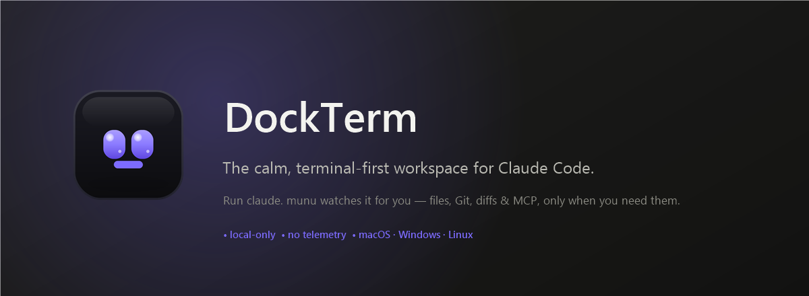
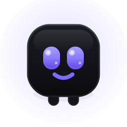
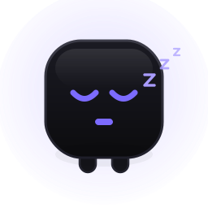
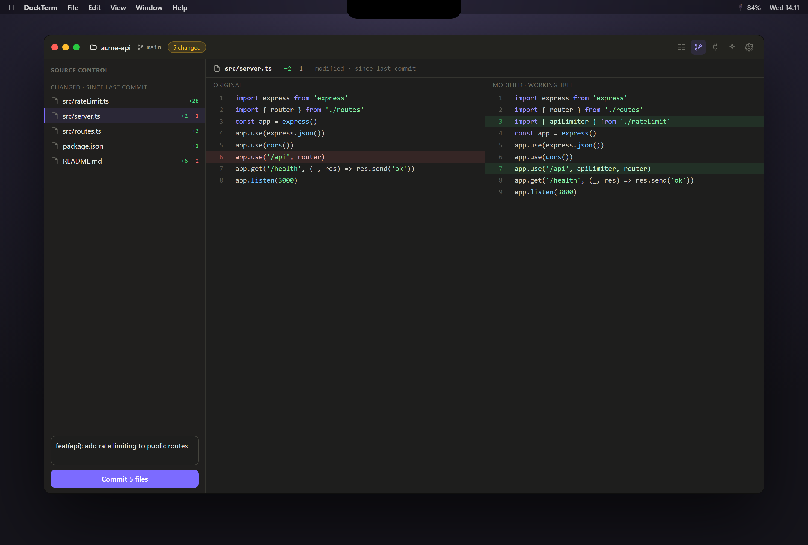

<p align="center">
  
</p>

<p align="center">
  <b>Run <code>claude</code>. munu watches it for you — files, Git, diffs &amp; MCP appear only when you need them.</b><br>
  <sub>No telemetry. No accounts. No cloud. Not opt-out — just absent.</sub>
</p>

<p align="center">
  <a href="../../releases"></a>
  <a href="../../releases"></a>
  <a href="../../stargazers"></a>
  <a href="LICENSE"></a>
  <a href="../../releases"></a>
  <a href="https://www.anthropic.com/claude-code"></a>
</p>

---

You run Claude Code in a terminal. It edits files, runs commands, changes your repo — and you keep alt-tabbing to an editor to *see* what changed, to a Git client to review and commit, to a file browser to poke around. And when Claude pauses to ask permission, you don't even notice until you look.

**DockTerm is the workspace that was missing.** A real terminal stays the hero of the screen — you run `claude` exactly like today. Everything else (a diff of what Claude just changed, one-click safe commits, an image preview, your MCP servers) appears *on demand* and gets out of the way. And **munu**, a little mascot, sits in your notch and tells you — at a glance, even over fullscreen YouTube — whether Claude is **working**, **done**, or **waiting for your `[y/n]`**.

It is **not** an IDE and never calls an AI of its own. Claude Code is the AI; DockTerm is the calm room around it.

## 🎬 Meet munu

<table align="center">
  <tr>
    <td align="center" width="120"></td>
    <td align="center" width="120"></td>
    <td align="center" width="120"></td>
    <td align="center" width="120"></td>
    <td align="center" width="120"></td>
  </tr>
  <tr>
    <td align="center"><b>resting</b></td>
    <td align="center"><b>working</b><br><sub>Claude is busy</sub></td>
    <td align="center"><b>needs you</b><br><sub><code>[y/n]</code></sub></td>
    <td align="center"><b>done</b><br><sub>+ a soft chime</sub></td>
    <td align="center"><b>sleeping</b><br><sub>no project</sub></td>
  </tr>
</table>

munu is a Dynamic-Island mascot: it tucks into the **notch** and slides down when you reach for it, peeks for a few seconds whenever Claude's state changes, and **stays out the whole time Claude needs you** — so you never miss a permission prompt. It reads Claude's state from the terminal itself; it never auto-answers, never calls an API. (On Windows/Linux it lives as an auto-hiding pill at the top-center.)

> **🎥 A 15-second demo GIF goes a long way.** Record munu reacting (working → needs-you → done) over another app, drop it at `docs/screenshots/demo.gif`, and add `` right here.

## Why DockTerm?

| Instead of… | DockTerm gives you… |
|---|---|
| alt-tabbing to an editor to *see* a change | a syntax-highlighted **diff** of exactly what Claude touched, one keypress away |
| a heavy Git client (or risky raw commands) | **beginner-safe Git** — stage, commit, push, branch, with plain-language guards |
| booting a 400 MB IDE to review 3 lines | a terminal that *wraps* those views and hides them again |
| trusting a cloud AI tool with your code | **local-only** — no accounts, no telemetry, no AI calls of its own |
| missing Claude's permission prompts | **munu** flips to *needs you* in your notch and answers with one click |

## ✨ Features

| | |
|---|---|
| **Real terminal** | xterm.js + a native PTY (your real shell). True-color, unicode, WebGL, smooth scrolling. |
| **Tabs, splits & grids** | Many terminals as tabs, split any pane, or snap a tab into a **2×2 / 3×2 / 3×3 grid** — without killing what's running. |
| **Multi-project** | One project per window, *or* a grid where each pane is a different project. Focus a pane and the side panels follow it — even your live `cd`. |
| **munu** | The notch mascot that mirrors Claude's state and surfaces permission prompts with one-click **[y]/[n]**. |
| **Diff review + checkpoints** | See what changed since your last commit, this session, or a pinned checkpoint; open a side-by-side diff for any file. |
| **Beginner-safe Git** | Grouped status, stage/discard, commit, push/pull, branches — with confirmations that show the exact command. |
| **Files, editor & previews** | File tree, Monaco editor with a save-conflict guard, image & binary previews, drag-a-file-onto-a-terminal. |
| **MCP & Skills** | Read-only view of your MCP servers (classic, **claude.ai connectors**, and **plugins**) with secrets masked; browse & scaffold skills. |
| **Themes & zoom** | 7 themes + follow-system, and ⌘+/⌘−/⌘0 to scale the whole UI. |
| **Trustable** | macOS builds are **signed & notarized**. Per-user install, no admin. |



## ⬇️ Install

Grab the file for your system from [**Releases**](../../releases):

| System | File |
|---|---|
| 🍎 macOS (Apple Silicon) | `DockTerm-<ver>-macOS-Apple-Silicon.dmg` |
| 🍎 macOS (Intel) | `DockTerm-<ver>-macOS-Intel.dmg` |
| 🪟 Windows 10/11 | `DockTerm-<ver>-Windows.exe` |
| 🐧 Linux (x86-64) | `DockTerm-<ver>-Linux.AppImage` |

**macOS builds are signed & notarized — they open normally.** On Windows, if SmartScreen appears, choose **More info → Run anyway** (unsigned for now). Installs per-user, no admin.

## 🔒 Security

DockTerm is built to be trusted with your code:

- `contextIsolation` + `sandbox` on; production loads over a custom protocol with a strict CSP and **no remote content**.
- Every IPC channel is an explicit, zod-validated verb with a sender check — no generic bridge.
- Filesystem access is **jailed to the open project** (symlink-safe). Reading `~/.claude` is a separate opt-in.
- Every `git` call runs with `core.hooksPath=` so a malicious repo's hooks can't execute.
- MCP/skills config is **read-only and never executed**; secrets are masked to key names.
- **The telemetry code does not exist.**

Details: [docs/SECURITY_MODEL.md](docs/SECURITY_MODEL.md).

## 🛠️ Development

```bash
git clone https://github.com/munvard/dockterm && cd dockterm
npm install
npm run dev        # launch with HMR
npm run typecheck  # strict TS
npm test           # vitest
npm run build      # production bundles
```

Node 20+. See [CONTRIBUTING.md](CONTRIBUTING.md) for the architecture tour. **Issues and PRs welcome** — if DockTerm is useful to you, a ⭐ genuinely helps it reach other Claude Code users.

## 🗺️ Roadmap

Shipped: terminal + tabs/splits/grids, multi-window & per-pane projects, the munu Dynamic Island, diff review + checkpoints, beginner-safe Git, files/editor/previews, MCP & skills, 7 themes + zoom, signed/notarized macOS builds. Next in [docs/ROADMAP.md](docs/ROADMAP.md).

## ⭐ Star history

<a href="https://star-history.com/#munvard/dockterm&Date">
  
</a>

## License

[MIT](LICENSE) © DockTerm contributors. Built with Electron, xterm.js, Monaco, and simple-git. Made for [Claude Code](https://www.anthropic.com/claude-code).
