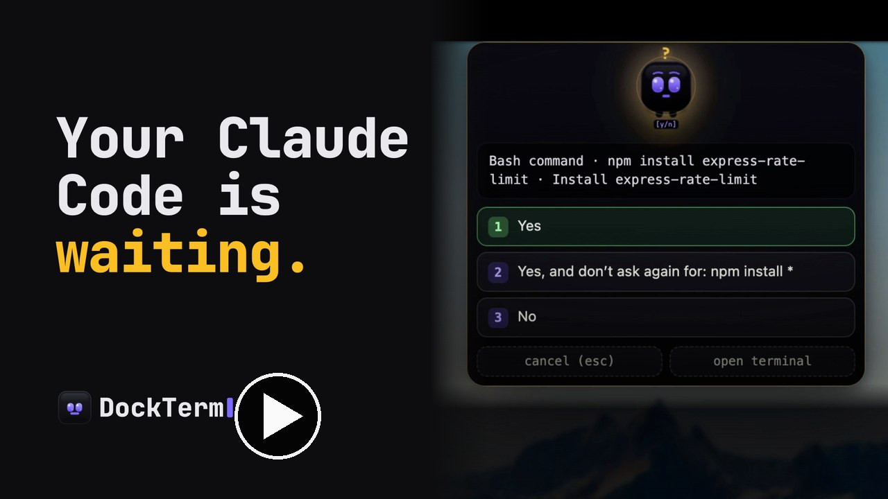
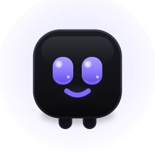
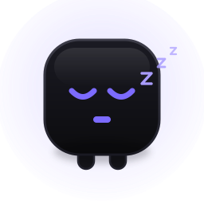

<p align="center"><a href="README.md">English</a> | 简体中文</p>

<p align="center">
  <picture>
    <source media="(prefers-color-scheme: dark)"  srcset="assets/brand/dockterm-logo.svg">
    <source media="(prefers-color-scheme: light)" srcset="assets/brand/dockterm-logo-light.svg">
    
  </picture>
</p>

<p align="center">
  <b>启动 Claude Code，然后去忙别的。</b><br>
  一个以终端为核心的 <a href="https://www.anthropic.com/claude-code">Claude Code</a> 工作区：保留你真正的 <code>claude</code> 会话，检查点、实时 agent、diff、Git、文件、MCP 和用量，一个快捷键就能打开。<br>
  还有 <b>munu</b>，一张住在刘海里的脸（也可以固定在屏幕任意位置），Claude 一需要你，它就会提醒你，哪怕你正在另一个桌面的全屏应用里。
</p>

<p align="center">
  
</p>

<p align="center">
  <b>支持 macOS、Windows 和 Linux。</b>免费、开源（MIT），无需账号，无遥测。<br>
  <a href="#安装">下载</a> · <a href="https://munetic.net/dockterm">官网</a> · <a href="../../issues">报告 Bug</a>
</p>

<p align="center">
  <a href="../../releases"></a>
  &nbsp;
  <a href="../../releases"></a>
  &nbsp;
  <a href="../../stargazers"></a>
  &nbsp;
  <a href="LICENSE"></a>
  &nbsp;
  <a href="https://munetic.net/dockterm"></a>
</p>

<p align="center">
  
  
  
  
  
</p>

<p align="center">
  
</p>
<p align="center"><sub>一个安静的窗口：你真正的 <code>claude</code> 会话占据中心，文件、diff、Git、MCP 和用量按需出现。每个窗格一个项目。</sub></p>

<p align="center">
  <video src="https://github.com/user-attachments/assets/843bdec3-c634-4382-963d-f0c96531d4c3" poster="https://raw.githubusercontent.com/munvard/dockterm/main/docs/screenshots/tour-poster.jpg" controls muted playsinline width="800">
    <a href="https://github.com/user-attachments/assets/843bdec3-c634-4382-963d-f0c96531d4c3">
      
    </a>
  </video>
  <br>
  <b>▶ 观看 54 秒导览</b>（请开启声音）
</p>

---

- 🔔 **munu**：一个住在刘海里的吉祥物（也可以固定在任意位置），它会读取 Claude 的状态并弹出权限提示，哪怕你在另一个桌面的全屏应用里。可以选你喜欢的脸：munu、nvurd、guru 或 adanana。
- 🧭 **Claude 对话的检查点**：查看当前会话中的提示词，随时跳回去，恢复操作则交给 Claude 自带的 `/rewind`。
- 🛰️ **实时 agent 动态**：当 Claude 启动子 agent 时，DockTerm 会显示数量、它们在做什么、已用时间和完成后的结果。
- ✂️ **把选中内容发给 Claude**：在终端里选中文字，就能作为引用片段发送给 Claude，不需要另做一套聊天界面。
- 📊 **真实用量一目了然**：来自 Claude 本身的**5 小时和每周额度**、**重置时间**，还有一条显示你比平均节奏快还是慢的标记线，在面板、顶栏标签和悬浮小组件里实时显示。
- 🔍 **diff 审查 + 安全的 Git**：清楚看到改了什么，然后暂存、提交，不用离开终端。
- 🗂️ **文件、编辑器、MCP、skills 和 agents**：需要时出现，不需要时消失。可以多选文件、把路径发给 Claude，也可以把真实文件拖到其他应用里。
- 🪟 **每个窗格一个项目**：网格里每个窗格对应不同的仓库，侧边面板跟随你当前聚焦的窗格。拖动窗格即可调整顺序。
- 🔒 **纯本地**：无账号，无遥测，自己从不调用任何 AI。

用 Claude Code 就意味着要一直守着终端：切到别的窗口看 diff、提交代码，或者确认它是不是卡在了 `[y/n]` 上。DockTerm 让终端保持在中心，把其余的东西送到你面前，这样你就可以放心让 Claude 干活，真正走开一会儿。Claude Code 负责干活，DockTerm 是围绕它的那个安静窗口。

**它保留你真正的 `claude`，而不是取代它。** 有些 Claude Code 的图形界面（Claudia/Opcode）会用自己的聊天界面替换你的终端，DockTerm 不一样：它包裹的是你实际的会话，再围绕它构建各种视图。不用重新学习，Claude Code 更新时也能保持兼容。

### 对比

|  | 纯终端 | 完整 IDE | Claude 图形界面 | **DockTerm** |
|---|:---:|:---:|:---:|:---:|
| 保留你真正的 `claude` 会话 | ✅ | ✅ | ❌ 被替换 | ✅ |
| 高亮显示 Claude 改动的 diff 审查 | ❌ | ✅ | ~ | ✅ |
| 不用裸 `git` 就能暂存和提交 | ❌ | ~ | ~ | ✅ |
| Claude 需要你时会通知你（全屏也行） | ❌ | ❌ | ❌ | ✅ **munu** |
| 运行时显示 Claude 子 agent | ❌ | ❌ | ~ | ✅ |
| 当前 Claude 会话的检查点 | ❌ | ❌ | ~ | ✅ |
| 把选中的终端文字发回给 Claude | 手动 | 手动 | ~ | ✅ |
| 一眼看到真实用量、节奏和重置时间 | ❌ | ❌ | ❌ | ✅ |
| 不碍事 | ✅ | ❌ 太重 | ~ | ✅ |
| 无遥测，纯本地 | ~ | ❌ | ~ | ✅ |

*光靠终端，没法高亮显示 Claude 改了什么，也没法安全地提交，更没法在你切到别的窗口时告诉你 Claude 在等你。为了看三行代码就打开一整个 IDE，又会打断思路。DockTerm 正好处在两者之间。*

## munu

DockTerm 从终端输出中读取 Claude 的状态，并以 **munu** 的形式显示出来。munu 是菜单栏附近的一张小脸，在 MacBook 上就在刘海里。你一眼就能看出 Claude 是在工作、已经完成，还是在等你回答 `[y/n]`，即使 DockTerm 被其他窗口挡住也一样。当 Claude 停下来请求权限时，munu 会把提示弹出来，你点一下就能回答，包括多选和自由文本回答，思路不会被打断。它的一切判断都来自终端，**从不自动回答**，也**从不调用任何 API**。

<p align="center"></p>
<p align="center"><sub>去看点全屏的东西吧，munu 会浮在上面（即使在另一个桌面或 Space），把 Claude 的提示送到你面前，不会错过。</sub></p>

默认情况下，munu 藏在刘海里，鼠标悬停时滑出来，Claude 状态变化时会探出头停留几秒。想让它一直可见？**把它固定住，再拖到屏幕上任何位置**，放在哪它就一直待在哪。在 Windows 和 Linux 上，它是屏幕顶部一个会自动隐藏（或固定）的小胶囊。

#### 选择你的伙伴

<table align="center">
  <tr>
    <td align="center" width="130"></td>
    <td align="center" width="130"></td>
    <td align="center" width="130"></td>
    <td align="center" width="130"></td>
  </tr>
  <tr>
    <td align="center"><b>munu</b></td>
    <td align="center"><b>nvurd</b></td>
    <td align="center"><b>guru</b></td>
    <td align="center"><b>adanana</b></td>
  </tr>
</table>

#### …各种状态

<table align="center">
  <tr>
    <td align="center" width="136"></td>
    <td align="center" width="136"></td>
    <td align="center" width="136"></td>
    <td align="center" width="136"></td>
    <td align="center" width="136"></td>
  </tr>
  <tr>
    <td align="center">空闲</td>
    <td align="center">工作中</td>
    <td align="center">需要你</td>
    <td align="center">完成</td>
    <td align="center">没有项目</td>
  </tr>
</table>

## 功能一览

- **快速打开和全文搜索**：按名称找任何文件（`⌘P` / `Ctrl Shift L`），或在任何文件里搜索文字（`⌘⇧F` / `Ctrl Shift F`），需要时也包括被忽略的文件夹。索引在主线程之外运行，20 万个文件也依然很快。
- **安静的顶栏**：始终保留一块可以抓住并拖动窗口的空白区域，标签栏的空白处同样可以拖动窗口，空间不够时各项按固定顺序让位（标签变短，面板图标收进菜单），不会互相重叠。双击可缩放窗口，和 Mac 上的普通窗口一样，全屏时也会自动适配。
- **真正的终端**：xterm.js 跑在原生 PTY 上（就是你真正的 shell）。支持标签页、分屏、网格、真彩色、unicode、搜索，以及原生、即时的滚动。拖动窗格即可调整网格顺序。
- **聊天模式：**在任意窗格按 `⌘R` / `Ctrl Shift R`，就能把 Claude 的会话当成一段清晰的对话来读，带有工作计时器，权限提示变成按钮，还有输入框，支持附件、智能粘贴、`/` 和 `@` 菜单、历史记录和草稿。按住麦克风就能通过 Claude 自带的语音模式说话。真正的终端仍在底下运行，再按一次快捷键就能切回去。
- **阅读舒适度：**可以停靠或悬浮的当前对话 Reading 视图，一套暖色低眩光的 Reading 主题，行高、字间距和内边距的调节，并带有一键预设，还有 Zen 模式（`⌘.` / `Ctrl Shift .`），会隐藏顶栏和侧边面板，只留下你的窗格。
- **Claude 工作流辅助**：一键启动 `claude` / `claude --resume`，当前对话的检查点栏，以及“发送给 Claude”的选区工具栏，可以把终端文字变成带引用的提示词片段。
- **实时 agent 动态**：顶栏的计数标签、Activity 面板和 munu 蜂群，会显示 Claude Code 子 agent 的启动、运行和完成，按项目分组，数据读取自本地 transcript。
- **退出后保留终端记忆**：完全退出应用后，DockTerm 会恢复每个终端可见的滚动内容，所以更新应用后你不会面对一个空白的 shell。用 `claude --resume` 继续 Claude 真正的对话。
- **真实用量限制，实时显示**：Usage 面板、紧凑的顶栏标签（默认显示 `5h 11%`）和可弹出的悬浮小组件，会显示 Claude Code 自己报告的滚动 **5 小时**和**每周**真实百分比，带重置倒计时和警告颜色。可以用百分比、条形、环形或曲线图显示。**平均节奏标记**（默认开启，可以关闭）会标出如果你均匀使用整个窗口，用量本应到达的位置：环形和条形上是一条短线，曲线图上是虚线，百分比视图里是一个小箭头。Claude 还没发送数据时显示“no data yet”。你自己的 Claude 设置和状态栏不会被改动。只在本地读取，数据不会离开你的机器。
- **diff 审查**：清楚看到自上次提交以来、本次会话中，或某个固定检查点以来改了什么，并且在信任之前，可以为任何文件打开并排 diff。
- **对新手安全的 Git**：分组的状态、暂存/丢弃、提交、push/pull、分支，高风险操作会先确认，并显示它将要执行的确切命令。
- **文件、编辑器和预览**：文件树，带保存冲突保护的 Monaco 编辑器，图片和二进制文件预览；把文件或文件夹拖进终端就能插入它的路径，用 `⌘`/`Ctrl` 多选，还能把真实文件拖到其他应用里。
- **MCP、skills 和 agents**：以只读方式查看你的 MCP 服务器（项目级、用户级、claude.ai 连接器和插件提供的），密钥已被遮盖，同时还能看到你的 skills、斜杠命令和子 agent；可以浏览并创建 skills 脚手架。
- **每个窗格一个项目**：网格里每个窗格对应不同的仓库；聚焦某个窗格，侧边面板就会跟着切换，包括实时的 `cd`。
- **命令面板**：`⌘K` / `Ctrl Shift P`，跳转到任何地方。
- **主题和缩放**：十套主题（包括 Tokyo Night、Catppuccin、Nord、Rosé Pine、Ubuntu 风格的 Aubergine 和 Gruvbox），外加跟随系统，以及用 `⌘`/`Ctrl` `+ / − / 0` 缩放整个界面。
- **应用内更新**：DockTerm 会检查新版本，一键就能为你的平台下载并安装最新版。

#### 分成网格，每个窗格一个项目
<p align="center"></p>

#### 打开任意项目，Claude 跑在真正的终端里
<p align="center"></p>

#### 你的文件、编辑器和图片预览
<p align="center"></p>

#### 先审查 Claude 改了什么，准备好了再提交
<p align="center"></p>

#### MCP、skills 和 agents：只读，密钥已遮盖
<p align="center"></p>

#### 检查点、选区和实时 agent，都围绕你真正的 Claude 终端构建

DockTerm 不会用一个聊天界面的复制品来取代 Claude Code。它监视真正的终端和本地的 Claude transcript，然后在周围加上一些小的工作流界面：

- **检查点栏**跟随当前聚焦终端里活跃的 Claude 会话。它列出你的提示词，过滤掉系统和工具产生的噪音，可以跳回选中的检查点，需要恢复时会打开 Claude 自带的 `/rewind`。
- **发送给 Claude**会在你选中终端文字时出现。在普通 shell 里它使用终端的选区，在 Claude Code 里它可以使用 Claude 复制的选区，所以同一个按钮照样能用。
- **Agent Activity**全局显示实时的子 agent，按项目分组，带有已用时间计时器和结果预览。当 agent 数量变化时，munu 会短暂显示一小群 agent。

#### 看看你的额度还剩多少
<p align="center"></p>

#### 十套主题，浅色和深色
<p align="center"></p>

#### munu 固定在任意位置，随 Claude 的工作而变化
<p align="center"></p>

## 键盘快捷键

DockTerm 使用你在各平台默认终端里已经熟悉的快捷键，也从不抢 shell 需要的按键（单独的 `Ctrl C`/`Ctrl W` 始终交给 shell）。

| 操作 | macOS | Windows / Linux |
|---|---|---|
| 新建标签页 | `⌘T` | `Ctrl Shift T` |
| 新建窗口 | `⌘N` | `Ctrl Shift N` |
| 关闭标签页 | `⌘W` | `Ctrl Shift W` |
| 命令面板 | `⌘K` | `Ctrl Shift P` |
| 打开项目 | `⌘O` | `Ctrl Shift O` |
| 文件 / Git / 审查面板 | `⌘B` / `⌘G` / `⌘E` | `Ctrl Shift B / G / E` |
| 聚焦窗格的聊天模式 | `⌘R` | `Ctrl Shift R` |
| Zen 模式 | `⌘.` | `Ctrl Shift .` |
| 撰写长提示词 | `⌘⇧⏎` | `Ctrl Shift Enter` |
| 向右分屏 | `⌘D` | `Ctrl Shift D` |
| MCP 面板 | `⌘⇧M` | `Ctrl Shift M` |
| 迷你终端 | `⌘J` | `Ctrl Shift J` |
| 设置 | `⌘,` | `Ctrl Shift ,` |
| 放大 / 缩小 / 重置 | `⌘ + / − / 0` | `Ctrl Shift + / − / 0` |
| 滚动到顶部 / 底部 | `⌘↑ / ⌘↓` | `Shift PageUp / PageDown` |
| 唤出 / 隐藏 DockTerm（全局） | `⌘⇧\`` | `Ctrl Shift \`` |

## 安装

**macOS，使用 Homebrew：**

```bash
brew install --cask munvard/dockterm/dockterm
```

**或者从 [Releases](../../releases) 下载：**

| 系统 | 文件 |
|---|---|
| macOS (Apple Silicon) | `DockTerm-<version>-macOS-Apple-Silicon.dmg` |
| macOS (Intel) | `DockTerm-<version>-macOS-Intel.dmg` |
| Windows 10/11 | `DockTerm-<version>-Windows.exe` |
| Linux (x86-64) | `DockTerm-<version>-Linux.AppImage` |

macOS 版本已**签名并通过公证**，可以正常打开。Windows 版本暂时未签名，如果出现 SmartScreen 提示，请选择 *更多信息 → 仍要运行*。按用户安装，不需要管理员权限。之后 DockTerm 可以在应用内自行保持更新。

## 隐私与安全

DockTerm 的设计目标，是让你放心把代码交给它：

- **无遥测，无账号，自己没有 AI。**它只会运行*你自己的* `claude`。
- 用量数字读取自你本地的 `~/.claude` 文件，**只读**，从不读取消息内容，也不会上传任何东西。
- 开启了 `contextIsolation` 和 `sandbox`；生产环境通过自定义协议加载，使用严格的 CSP，没有任何远程内容。
- 每个 IPC 通道都是一个明确的、经过 schema 校验的动作，并带有发送方检查。
- 文件系统访问被限制在当前打开的项目内（防符号链接绕过）。读取 `~/.claude` 需要单独选择开启。
- 检查点和 Agent Activity 以只读方式读取 `~/.claude` 下的本地 Claude transcript 文件，不会修改、上传或执行它们。
- 每次 `git` 调用都带着 `core.hooksPath=` 运行，所以恶意仓库的 hook 无法执行。
- MCP 和 skill 配置是只读的，也从不执行；密钥只显示键名。

更多内容见 [docs/SECURITY_MODEL.md](docs/SECURITY_MODEL.md)。

## 常见问题

**我的代码或任何数据会离开我的机器吗？**
不会。DockTerm 没有遥测，自己也从不调用 AI。用量数字来自你本地的 `~/.claude` 文件，只读。

**我还能继续用平常的 `claude` 吗？**
可以。DockTerm 把你真正的 Claude Code 会话包裹在一个真正的 shell 里。不用重新学习，Claude Code 更新时也能保持兼容。

**用量百分比和我的套餐完全一致吗？**
是的。它们就是 Claude Code 自己报告的真实 5 小时和每周数字，重置时间也一起给出。Claude 还没发送数据时，你会看到“no data yet”，而不是一个猜测值。DockTerm 不会为此修改你的 Claude 设置或状态栏。

**Windows 提示“未知发布者”。**
Windows 版本暂时未签名：请选择 *更多信息 → 仍要运行*。macOS 版本已签名并通过公证。

**munu 会替我回答 Claude 吗？**
绝不会。它只负责弹出提示，由你来点。它从终端推断状态，从不调用 API。

## 从源码构建

```bash
git clone https://github.com/munvard/dockterm && cd dockterm
npm install
npm run dev        # run with hot reload
npm test           # unit tests (vitest)
npm run build      # production bundles
```

需要 Node 22+。架构说明见 [CONTRIBUTING.md](CONTRIBUTING.md)。

## 项目状态

还处于早期，但在积极开发，每天都在用，并且**是用 Claude Code 本身构建和维护的。**它是一个 Electron 应用，所以安装包比较大。macOS 版本已经过公证，Windows 版本暂时未签名。难免会有 Bug 和不完善的地方，欢迎提 [issue](../../issues) 和 PR。

## 许可证

[MIT](LICENSE)。使用 Electron、xterm.js、Monaco 和 simple-git 构建。
